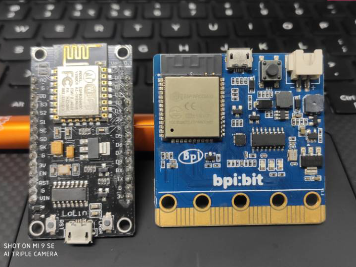
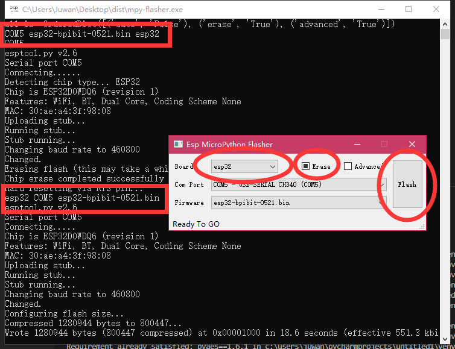

# &emsp;&emsp;&emsp;&emsp;&emsp;An Flash MicroPython firmware Tool.

[中文文档](README.md)

# mpy-flasher

[](./LICENSE)

ESPRESSIF SYSTEMS (SHANGHAI) ESP8266/ESP32 burn MicroPython firmware GUI tools.

## Features:

1. Automatically find the firmware (.bin) file in the serial port and startup directory.

2. Support startup configuration, you can define automatic operation, whether to erase, advanced burning.

3. Allows calls to custom Python esptool scripts, such as esp_config.py.

4. Run the GUI and CMD interfaces at the same time to get the background log information, and post the screenshot of the problem.

5. Green single file under Windows, out of the box, or using Python for cross-platform operation.

## System requirements

- Python 3.5.4 +
- requirements.txt

### 运行 mpy-flasher 软件

### 1. into [releases](https://github.com/junhuanchen/mpy-flasher/releases) download mpy-flasher.exe.

Find the version of the system you are using and download it.


#### 2. running mpy-flasher.py

```shell
pip install -r requirements.txt

python mpy-flasher.py
```


## Write MicoPython firmware

Here are two examples of bpibit and nodemcu hardware.



Nodemcu (esp8266) on the left and bpibit (esp32) on the right can be used to burn MicroPython firmware (based on esptool dependencies).

After running the software, you can click on the Board to select the version esp8266 or esp32,


Connect to your hardware and the current hardware Port (Com Port) will appear, as shown in figure com5-usb-serial CH340 (COM5).


Click the 'COM5' option as shown in the figure to select the hardware to burn, and then select the firmware to burn according to your hardware.

## Prepare the MicroPython firmware (.bin) file

You can download the firmware. If you don't know where to download, can go to the [micropython download] (http://www.micropython.org/download) to download the official standard firmware and software in the same directory, the following figure.


Then the software will automatically find the firmware for you to choose to burn.

## Write Bpibit (esp32) MicroPython

You can see that after inserting the Bpibit hardware, the software will display the following.



According to the red circle, select esp32, tick Erase, select esp32-bpibit-0521.bin firmware, click Flash to run burn.

## Burn NodeMCU (esp8266) MicroPython

You can see that after inserting the NodeMCU hardware, the software will display the following.


According to the red circle, select esp8266, tick Erase, select esp8266-20190125-v1.10.bin firmware, click Flash to run burn.

## Advanced burn mode
If you don't want to use the built-in MicroPython burn scripts, you can also place the following sample script [esp_config.py](https://github.com/junhuanchen/mpy-flasher/blob/master/esp_config.py) custom esptool burn scripts in the same directory as the software, as shown in the following code.

```python
import os

def flash(com):
    FLASH_START = "0x1000"
    FLASH_MODE = "dio"
    FLASH_FREQ = "40m"

    import sys
    sys.argv = [
        'AutoFlash.py', '--chip', 'esp32',
        '--port', com,
        '--baud', '460800',
        'write_flash', '-z',
        '--flash_mode', FLASH_MODE,
        '--flash_size', '4MB',
        '--flash_freq', FLASH_FREQ,
        FLASH_START, os.getcwd() + '\\firmware.bin'
    ]

    try:
        from esptool import main
        main()
        return None
    except Exception as e:
        print(e)
return str(e)
```


## Automatic burn configuration

If you give the software to a beginner, you can prepare the initial configuration for him so that he can write it with one click.

By default, the software automatically generates the config.ini configuration file in the same directory. The contents are as follows.


```ini
[DEFAULT]
auto = False
erase = False
advanced = False
```

The corresponding configuration functions are as follows:

- auto if this configuration item exists and the value is True, the software will automatically run the burn after startup, just like clicking Flash.

- erase if this configuration item exists, and the value is True, the software will automatically check the erase option upon startup.

- advanced if this configuration item exists and the value is True, the advanced option is automatically checked when the software starts.

# pyinstaller

1. create mpy-flasher.exe

pyinstaller -c -F mpy-flasher.py -i logo.ico -p venv\Lib\site-packages

# uplaod pypi

```shell
python setup.py sdist build
```

```shell
# pip install twine
twine upload dist/* --verbose
```

