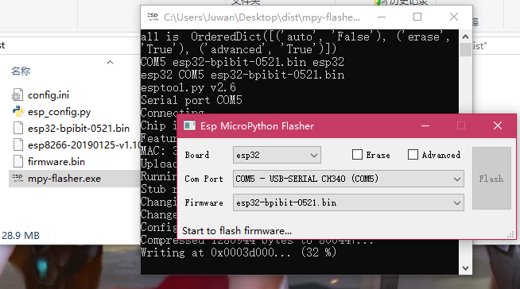
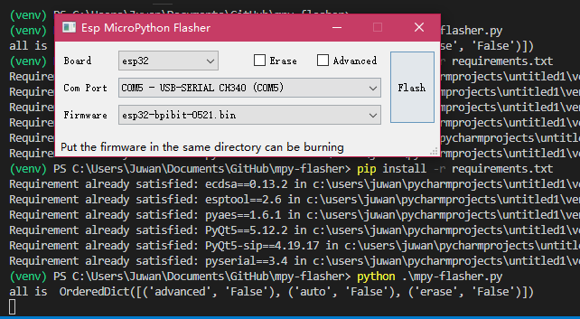
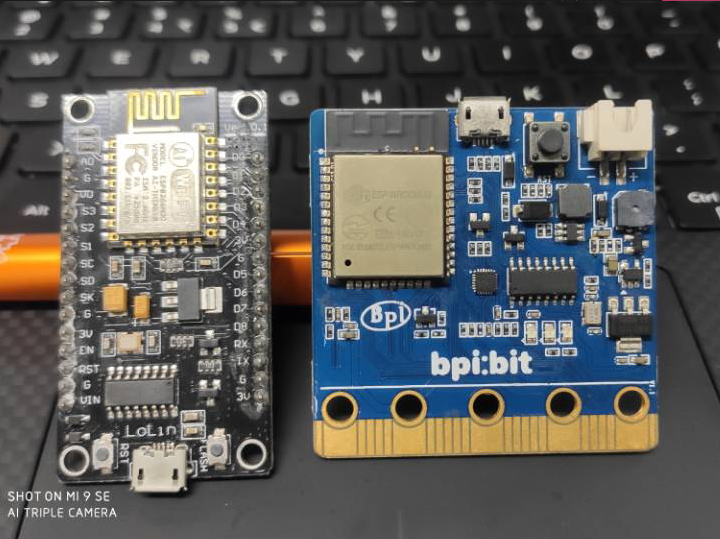
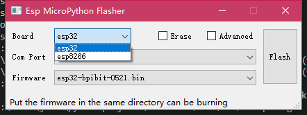
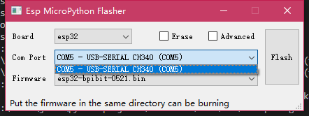

# mpy-flasher [English](English.md)

乐鑫 esp 系列烧录 MicroPython 简易 GUI 烧写工具。

特点：

1. 自动查找 本机串口 和 启动目录下的固件（.bin）文件。

2. 支持启动配置，可以定义自动运行、是否擦除、高级烧录。

3. 允许调用自定义的 Python esptool 烧写脚本，例如：esp_config.py。

4. 同时运行 GUI 和 CMD 界面，可得知后台 log 信息，遇到问题截图贴出即可。

5. Windows 下绿色单文件，开箱即用，也可使用 Python 跨平台运行。

# 使用方法

## 运行 mpy-flasher 软件

### 1. 到 [releases](https://github.com/junhuanchen/mpy-flasher/releases) 下载 editor.exe 。

寻找你所用的系统版本并下载，如果下载很慢，可以用[微云地址](https://share.weiyun.com/5Jvl8ln)，下载后双击运行它。



### 2. 运行 mpy-flasher.py 代码

```shell
pip install -r requirements.txt

python mpy-flasher.py
```



## 烧写 MicoPython 固件

以下面的两款 bpibit 和 nodemcu 硬件为例。



左边是 nodemcu (esp8266) 右边是 bpibit (esp32) ，均可以使用该工具烧录 MicroPython 固件（基于 esptool 依赖）。

运行软件后，可以点击 Board 下拉选择版型 esp8266 或 esp32 ，



此时连接你的硬件，此时会出现当前硬件的端口号（Com Port），如图中的 COM5 - USB-Serial CH340 (COM5)。



点击如图的 'COM5' 选项即可选定了烧写的硬件，之后就是根据你的硬件来选择烧写的固件。

## 准备 MicroPython 固件（.bin）文件

如图

## 烧写 Bpibit （esp32）的 MicroPython

## 烧写 NodeMCU （esp8266）的 MicroPython

# pyinstaller

3. create mpy-flasher.exe

pyinstaller -c -F mpy-flasher.py -i logo.ico -p venv\Lib\site-packages

# uplaod pypi

```shell
python setup.py sdist build
```

```shell
# pip install twine
twine upload dist/* --verbose
```

