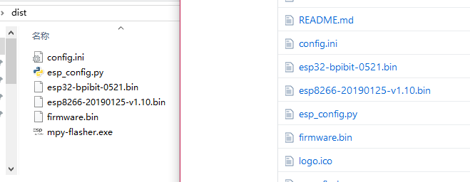
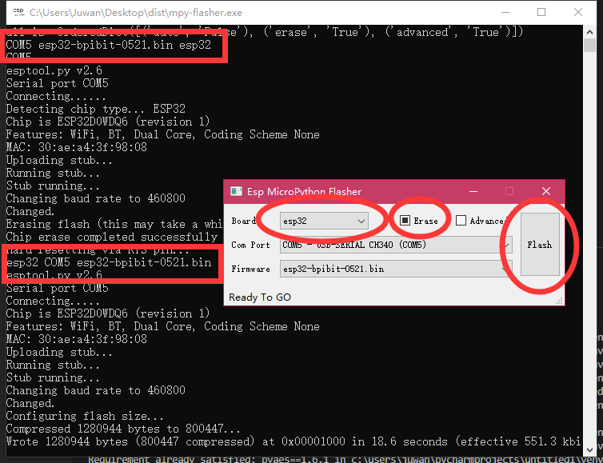
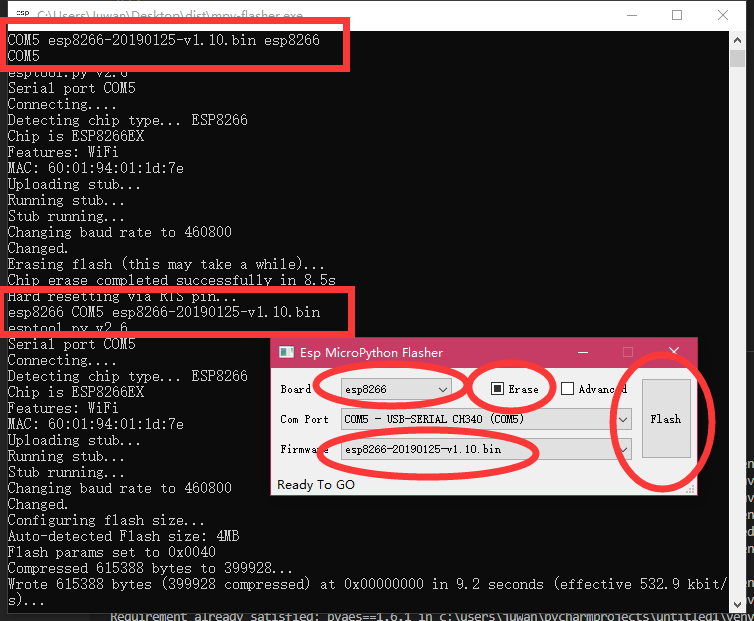
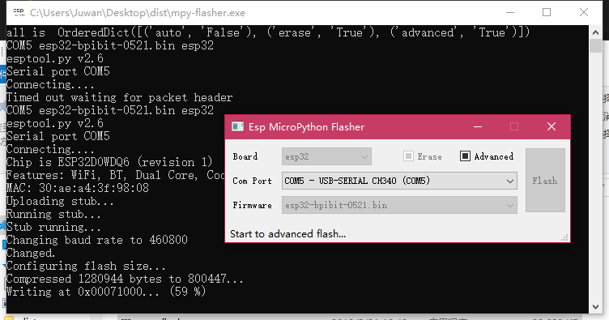
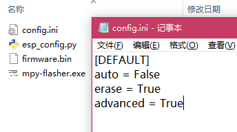

# mpy-flasher [English](English.md)

[](./LICENSE)

上海乐鑫 ESP8266 / ESP32 系列芯片烧录 MicroPython 简易 GUI 烧写工具。

## 特点：

1. 自动查找 本机串口 和 启动目录下的固件（.bin）文件。

2. 支持启动配置，可以定义自动运行、是否擦除、高级烧录。

3. 允许调用自定义的 Python esptool 烧写脚本，例如：esp_config.py。

4. 同时运行 GUI 和 CMD 界面，可得知后台 log 信息，遇到问题截图贴出即可。

5. Windows 下绿色单文件，开箱即用，也可使用 Python 跨平台运行。

## 系统要求

- Python 3.5.4 +
- requirements.txt

## 使用方法

### 运行 mpy-flasher 软件

### 1. 到 [releases](https://github.com/junhuanchen/mpy-flasher/releases) 下载 mpy-flasher.exe 。

寻找你所用的系统版本并下载，如果下载很慢，可以用[微云地址](https://share.weiyun.com/5Jvl8ln)，下载后双击运行它。


#### 2. 运行 mpy-flasher.py 代码

```shell
pip install -r requirements.txt

python mpy-flasher.py
```


## 烧写 MicoPython 固件

以下面的两款 bpibit 和 nodemcu 硬件为例。


左边是 nodemcu (esp8266) 右边是 bpibit (esp32) ，均可以使用该工具烧录 MicroPython 固件（基于 esptool 依赖）。

运行软件后，可以点击 Board 下拉选择版型 esp8266 或 esp32 ，


此时连接你的硬件，此时会出现当前硬件的端口号（Com Port），如图中的 COM5 - USB-Serial CH340 (COM5)。


点击如图的 'COM5' 选项即可选定了烧写的硬件，之后就是根据你的硬件来选择烧写的固件。

## 准备 MicroPython 固件（.bin）文件

你可以将下载好的固件，如果你不知道在哪下载，可以到 [micropython download](http://www.micropython.org/download) 下载官方标准的固件与软件置于同一目录下，如下图效果。



这样软件就会自动查找到固件，供你选择烧录了。

## 烧写 Bpibit （esp32）的 MicroPython

你可以看到将 Bpibit 硬件插入后，软件会显示如下情况。



根据红圈可以知道，选中了 esp32 ，勾选了 Erase （擦除板子），选择了esp32-bpibit-0521.bin 固件，点击 Flash 后运行烧写。

## 烧写 NodeMCU （esp8266）的 MicroPython

你可以看到将 Bpibit 硬件插入后，软件会显示如下情况。



根据红圈可以知道，选中了 esp8266 ，勾选了 Erase （擦除板子），选择了 esp8266-20190125-v1.10.bin 固件，点击 Flash 后运行烧写。

## 高级烧写模式

如果你不想使用内置的 MicroPython 烧写脚本的方式，你也在软件同目录下放置以下示例脚本 [esp_config.py](https://github.com/junhuanchen/mpy-flasher/blob/master/esp_config.py) 来自定义 esptool 烧写脚本，如下代码所示。

```python
import os

def flash(com):
    FLASH_START = "0x1000"
    FLASH_MODE = "dio"
    FLASH_FREQ = "40m"

    import sys
    sys.argv = [
        'AutoFlash.py', '--chip', 'esp32',
        '--port', com,
        '--baud', '460800',
        'write_flash', '-z',
        '--flash_mode', FLASH_MODE,
        '--flash_size', '4MB',
        '--flash_freq', FLASH_FREQ,
        FLASH_START, os.getcwd() + '\\firmware.bin'
    ]

    try:
        from esptool import main
        main()
        return None
    except Exception as e:
        print(e)
return str(e)
```



## 自动烧写配置

如果你将软件给一个初学者使用，你可以为他准备好初始配置，这样他就可以一键烧写了。

软件默认会在同目录下自动生成 config.ini 配置文件，其内容如下。



```ini
[DEFAULT]
auto = False
erase = False
advanced = False
```

对应的配置功能如下：

- auto 如果存在这个配置项，且值为 True，软件启动后会自动运行烧写，如同点击 Flash。

- erase 如果存在这个配置项，且值为 True，软件启动后会自动勾选 Erase 选项。

- advanced 如果存在这个配置项，且值为 True，软件启动后会自动勾选 Advanced 选项。

# pyinstaller

1. create mpy-flasher.exe

pyinstaller -c -F mpy-flasher.py -i logo.ico -p venv\Lib\site-packages

# uplaod pypi

```shell
python setup.py sdist build
```

```shell
# pip install twine
twine upload dist/* --verbose
```

